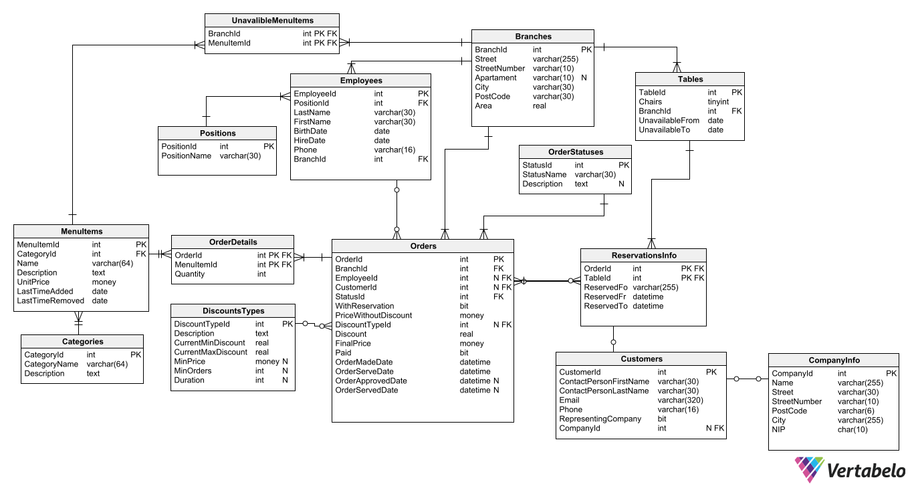

# Dokumentacja
- [Dokumentacja](#dokumentacja)
  - [Schemat](#schemat)
  - [Tabele](#tabele)
    - [Branches](#branches)
    - [Categories](#categories)
    - [CompanyInfo](#companyinfo)
    - [Customers](#customers)
    - [DiscountsTypes](#discountstypes)
    - [Employees](#employees)
    - [MenuItems](#menuitems)
    - [OrderDetails](#orderdetails)
    - [OrderStatuses](#orderstatuses)
    - [Orders](#orders)
    - [Positions](#positions)
    - [ReservationsInfo](#reservationsinfo)
    - [Tables](#tables)
    - [UnavailableMenuItems](#unavailablemenuitems)
  - [Relacje](#relacje)
  - [Widoki](#widoki)
    - [PossibleMenuItemsView](#possiblemenuitemsview)
    - [Menu](#menu)
  - [Funkcje i Procedury](#funkcje-i-procedury)
    - [approveOrder](#approveorder)
    - [calculateDiscountWithId1](#calculatediscountwithid1)
    - [calculateDiscountWithId2](#calculatediscountwithid2)
    - [calculateDiscountWithId3](#calculatediscountwithid3)
    - [calculateDiscountWithId4](#calculatediscountwithid4)
    - [calculateDiscountWithId5](#calculatediscountwithid5)
    - [cancelOrder](#cancelorder)
    - [finishOrder](#finishorder)
    - [getDiscount](#getdiscount)
    - [getMonthlyRaportAboutDiscounts](#getmonthlyraportaboutdiscounts)
    - [getMonthlyRaportAboutMenu](#getmonthlyraportaboutmenu)
    - [getMonthlyReportAboutOrders](#getmonthlyreportaboutorders)
    - [getMonthlyRaportAboutReservations](#getmonthlyraportaboutreservations)
    - [getPossibleDiscounts](#getpossiblediscounts)
    - [getPreviousYearMonth](#getpreviousyearmonth)
    - [getPreviousYearQuater](#getpreviousyearquater)
    - [getRaportAboutCustomers](#getraportaboutcustomers)
    - [getWeeklyReportAboutDiscounts](#getweeklyreportaboutdiscounts)
    - [getWeeklyRaportAboutMenu](#getweeklyraportaboutmenu)
    - [getWeeklyReportAboutOrders](#getweeklyreportaboutorders)
    - [getWeeklyRaportAboutReservations](#getweeklyraportaboutreservations)
    - [getYearMonth](#getyearmonth)
    - [getYearQuater](#getyearquater)
    - [makeOrder](#makeorder)
    - [replaceMenu](#replacemenu)
    - [serveOrder](#serveorder)
    - [takeInvoiceForMonth](#takeinvoiceformonth)
    - [takeInvoiceForOrder](#takeinvoicefororder)
    - [takeOrder](#takeorder)
  - [Triggery](#triggery)
    - [CheckIfReservationCanBeMadeTrigger](#checkifreservationcanbemadetrigger)
    - [CheckIfCanOrderSeafoodTrigger](#checkifcanorderseafoodtrigger)
  - [Własne Typy](#własne-typy)
    - [OrderDetailsTable](#orderdetailstable)
    - [ReservationTable](#reservationtable)
    - [MenuReplacement](#menureplacement)
  - [Kontrola Dostępu](#kontrola-dostępu)
## Schemat  

## Tabele  
### Branches  
Tabela przechowuje dane o oddziałach firmy.  

**BranchId** - Identyfikator oddziału  
**Street** - Ulica  
**StreetNumber** - Numer budynku  
**Apartament** - Numer pokoju/apartamentu  
**City** - Miasto  
**PostCode** - Kod pocztowy  
**Area** - Powierzchnia lokalu  

```TSQL
CREATE TABLE Branches (
    BranchId int  NOT NULL IDENTITY,
    Street varchar(255)  NOT NULL,
    StreetNumber varchar(10)  NOT NULL,
    Apartament varchar(10)  NULL,
    City varchar(30)  NOT NULL,
    PostCode varchar(30)  NOT NULL,
    Area real  NOT NULL,
    CONSTRAINT Branches_pk PRIMARY KEY  (BranchId)
);
```

### Categories
Tabela przechowuje informacje o danych kategoriach dań.  

**CategoryId** - Identyfikator kategorii  
**CategoryName** - Nazwa kategorii  
**Description** - Opis kategorii  

```TSQL
CREATE TABLE Categories (
    CategoryId int  NOT NULL IDENTITY,
    CategoryName varchar(64)  NOT NULL,
    Description text  NOT NULL,
    CONSTRAINT Categories_pk PRIMARY KEY  (CategoryId)
);
```

### CompanyInfo
Przechowuje informacje o firmie klienta w tym dane potrzebne do faktury.  

**CompanyId** - Identyfikator firmy  
**Name** - Nazwa firmy  
**Street** - Ulica na której znajduje się jej oddział  
**StreetNumber** - Numer budynku  
**PostCode** - Adres pocztowy  
**City** - Miasto  
**NIP** - NIP firmy (narzucony jest na to pole warunek UNIQUE)  

```TSQL
CREATE TABLE CompanyInfo (
    CompanyId int  NOT NULL IDENTITY,
    Name varchar(255)  NOT NULL,
    Street varchar(30)  NOT NULL,
    StreetNumber varchar(10)  NOT NULL,
    PostCode varchar(6)  NOT NULL,
    City varchar(255)  NOT NULL,
    NIP char(10)  NOT NULL,
    CONSTRAINT NIP UNIQUE (NIP),
    CONSTRAINT CompanyInfo_pk PRIMARY KEY  (CompanyId)
);
```

### Customers
Przechowuje informacje o klientach. Na tabele narzucony jest warunek by RepresentingCompany = (NOT CompanyId = NULL)  

**CustomerId** - Identyfikator klienta  
**ContactPersonFirstName** - Imię osoby kontaktowej, w przypadku klientów indywidualnych jest to imię klienta  
**ContactPersonLastName**   - Nazwisko osoby kontaktowej, w przypadku klientów indywidualnych jest to nazwisko klienta  
**Email** - E-mali klienta  
**Phone** - Telefon kontaktowy  
**RepresentingCompany** - Flaga informująca czy klient jest indywidualny ( = 0) czy raczej reprezentuje firmę ( = 1)  
**CompanyId** - Identyfikator firmy, może przyjmować wartość NULL    

```TSQL
CREATE TABLE Customers (
    CustomerId int  NOT NULL IDENTITY,
    ContactPersonFirstName varchar(30)  NOT NULL,
    ContactPersonLastName varchar(30)  NOT NULL,
    Email varchar(320)  NOT NULL,
    Phone varchar(16)  NOT NULL,
    RepresentingCompany bit  NOT NULL,
    CompanyId int  NULL,
    CONSTRAINT CompanyNameAndIsACompany CHECK ((RepresentingCompany = 1 AND NOT CompanyId = NULL) OR  (RepresentingCompany = 0 AND CompanyId = NULL) ),
    CONSTRAINT CustomerId PRIMARY KEY  (CustomerId)
);
```

### DiscountsTypes
Przechowuje informacje o dostępnych rabatach, z tabelą mocno związane są funkcje calculateDiscountWithIdX gdzie X to identyfikator rabatu i w ich dokumentacji należy szukać szczegółowych informacji o znaczeniu danego pola.   

**DiscountTypeId** - Identyfikator Rabatu  
**Description** - Opis rabatu wraz z zasadą jego naliczania  
**CurrentMinDiscount** - Minimalna aktualna wartość procentowa rabatu. Na pole narzucony jest warunek by jego wartość była w przedziale (0,1>.  
**CurrentMaxDiscount** - Maksymalna aktualna wartość procentowa rabatu. Na pole narzucony jest warunek by jego wartość była w przedziale (0,1>.  
**MinPrice** - Minimalna cena, szczegóły opisane są w Description  
**MinOrders** - Minimalna liczba zamówień, szczegóły opisane są w Description  
**Duration** - Czas trwania,  szczegóły opisane są w Description  

```TSQL
CREATE TABLE DiscountsTypes (
    DiscountTypeId int  NOT NULL IDENTITY,
    Description text  NOT NULL,
    CurrentMinDiscount real  NOT NULL CHECK (CurrentMinDiscount <= 1 and 0 < CurrentMinDiscount),
    CurrentMaxDiscount real  NOT NULL CHECK (CurrentMaxDiscount <=1 and 0 < CurrentMaxDiscount),
    MinPrice money  NULL,
    MinOrders int  NULL,
    Duration int  NULL,
    CONSTRAINT DiscountsTypes_pk PRIMARY KEY  (DiscountTypeId)
);

```

### Employees
Tabel przechowuje informacje o pracownikach.  

**EmployeeId** - Identyfikator pracownika  
**PositionId** - Identyfikator tytułu zawodowego  
**LastName** - Nazwisko pracownika  
**FirstName** - Imię pracownika  
**BirthDate** - Data urodzenia  
**HireDate** - Data zatrudnienia  
**Phone** - Telefon kontaktowy  
**BranchId** - Identyfikator oddziału, który zatrudnia pracownika  

```TSQL
CREATE TABLE Employees (
    EmployeeId int  NOT NULL IDENTITY,
    PositionId int  NOT NULL,
    LastName varchar(30)  NOT NULL,
    FirstName varchar(30)  NOT NULL,
    BirthDate date  NOT NULL,
    HireDate date  NOT NULL,
    Phone varchar(16)  NOT NULL,
    BranchId int  NOT NULL,
    CONSTRAINT Employees_pk PRIMARY KEY  (EmployeeId)
);
```

### MenuItems
Tabela przechowuje dane o możliwych potrawach/napojach do umieszczenia w menu.  

**MenuItemId** - Identyfikator potrawy  
**CategoryId** - Identyfikator kategorii potrawy  
**Name** - Nazwa potrawy  
**Description** - Opis  
**UnitPrice** - Cena  
**LastTimeAdded** - Data ostatniego dodania potrawy do menu  
**LastTimeRemoved** - Data ostatniego ściągnięcia potrawy z menu  

```TSQL
CREATE TABLE MenuItems (
    MenuItemId int  NOT NULL IDENTITY,
    CategoryId int  NOT NULL,
    Name varchar(64)  NOT NULL,
    Description text  NOT NULL,
    UnitPrice money  NOT NULL,
    LastTimeAdded date  NOT NULL,
    LastTimeRemoved date  NOT NULL,
    CONSTRAINT MenuItems_pk PRIMARY KEY  (MenuItemId)
);
```

### OrderDetails
Tabela przechowuje informacje o potrawach w danym zamówieniu.  

**OrderId** - Identyfikator zamówienia  
**MenuItemId** - Identyfikator potrawy  
**Quantity** - Ilość danej potrawy w zamówieniu  

```TSQL
CREATE TABLE OrderDetails (
    OrderId int  NOT NULL,
    MenuItemId int  NOT NULL,
    Quantity int  NOT NULL CHECK (Quantity > 0),
    CONSTRAINT OrderDetails_pk PRIMARY KEY  (OrderId,MenuItemId)
);
```

### OrderStatuses
Tabela przechowuje informacje o możliwych statusach zamówienia.  

**StatusId** - Identyfikator statusu  
**StatusName** - Nazwa statusu  
**Description** - Opis co dany status oznacza  

```TSQL
CREATE TABLE OrderStatuses (
    StatusId int  NOT NULL IDENTITY,
    StatusName varchar(30)  NOT NULL,
    Description text  NULL,
    CONSTRAINT OrderStatuses_pk PRIMARY KEY  (StatusId)
);
```

### Orders
Przechowuje Informacje o zamówieniu. W zależności od statusu zamówienia na tabele narzucone są różne warunki.  

**OrderId** - Identyfikator zamówienia  
**BranchId** - Identyfikator oddziału w którym realizowane jest zamówienie  
**EmployeeId** - Identyfikator pracownika przyjmującego zamówienie  
**CustomerId** - Identyfikator klienta składającego zamówienie  
**StatusId** - Identyfikator statusu zamówienia  
**WithReservation** - Flaga informująca czy z zamówieniem skojarzona jest rezerwacja (=1)  
**PriceWithoutDiscount** - Cena bez rabatu  
**DiscountTypeId** - Identyfikator rabatu  
**Discount** - Wartość rabatu  
**FinalPrice** - cena z rabatem  
**Paid** - Flaga informująca czy zamówienie zostało opłacone  
**OrderMadeDate** - Czas złożenia zamówienia  
**OrderServeDate** - Czas w którym zamówienie powinno być odebrane  
**OrderApprovedDate** - Czas zatwierdzenia zamówienia przez pracownika  
**OrderServedDate** - Czas odebrania zamówienia  

Tabela posiada index na StatusId  

```TSQL
CREATE TABLE Orders (
    OrderId int  NOT NULL IDENTITY,
    BranchId int  NOT NULL,
    EmployeeId int  NULL,
    CustomerId int  NULL,
    StatusId int  NOT NULL,
    WithReservation bit  NOT NULL DEFAULT 0,
    PriceWithoutDiscount money  NOT NULL,
    DiscountTypeId int  NULL,
    Discount real  NOT NULL DEFAULT 0 CHECK (Discount <= 1 and Discount >= 0),
    FinalPrice money  NOT NULL,
    Paid bit  NOT NULL,
    OrderMadeDate datetime  NOT NULL,
    OrderServeDate datetime  NOT NULL,
    OrderApprovedDate datetime  NULL,
    OrderServedDate datetime  NULL,
    CONSTRAINT checkForStatusInter CHECK ((StatusId = 1 AND NOT CustomerId = NULL) OR (StatusId = 2 AND NOT EmployeeId = NULL AND NOT OrderApprovedDate = NULL) OR (StatusId = 3 AND NOT OrderServedDate = NULL) OR (StatusId > 3)),
    CONSTRAINT Orders_pk PRIMARY KEY  (OrderId)
);

CREATE INDEX Status on Orders (StatusId ASC);
```

### Positions
Przechowuje dane o tytułach zawodowych.  

**PositionId** - Identyfikator tytułu  
**PositionName** - Nazwa tytułu  


```TSQL
CREATE TABLE Positions (
    PositionId int  NOT NULL IDENTITY,
    PositionName varchar(30)  NOT NULL,
    CONSTRAINT Positions_pk PRIMARY KEY  (PositionId)
);
```

### ReservationsInfo
Przechowuje dane o rezerwacjach. Narzucono warunek by czas rezerwacji był większy od 0.  

**OrderId** - Identyfikator zamówienia  
**TableId** - Identyfikator stolika  
**ReservedFor** - Dla kogo zarezerwowano stolik  
**ReservedFrom** - Czas rozpoczęcia rezerwacji  
**ReservedTo** - Czas zakończenia rezerwacji  

```TSQL
CREATE TABLE ReservationsInfo (
    OrderId int  NOT NULL,
    TableId int  NOT NULL,
    ReservedFor varchar(255)  NOT NULL,
    ReservedFrom datetime  NOT NULL,
    ReservedTo datetime  NOT NULL,
    CONSTRAINT ReservationTimeMustBePositive CHECK ((ReservedTo - ReservedFrom) > 0),
    CONSTRAINT ReservationsInfo_pk PRIMARY KEY  (OrderId,TableId)
);
```

### Tables
Tabela przechowuje dane o stolikach.  

**TableId** - Identyfikator stolika  
**Chairs** - Liczba krzeseł przy stoliku  
**BranchId** - Identyfikator oddziału w którym znajduje się stolik  
**UnavailableFrom** - Data startu niedostępności stolika  
**UnavailableTo** - Data końca niedostępności stolika  

Tabela posiada index na kolumnie BranchId

```TSQL
CREATE TABLE Tables (
    TableId int  NOT NULL IDENTITY,
    Chairs tinyint  NOT NULL,
    BranchId int  NOT NULL,
    UnavailableFrom date  NOT NULL,
    UnavailableTo date  NOT NULL,
    CONSTRAINT Tables_pk PRIMARY KEY  (TableId)
);

CREATE INDEX Branch on Tables (BranchId ASC)
;
```

### UnavailableMenuItems
Przechowuje informacje o wyczerpaniu danej pozycji z menu.  

**BranchId** - Identyfikator oddziału w którym wyczerpano danie  
**MenuItemId** - Identyfikator dania  

```TSQL
CREATE TABLE UnavailableMenuItems (
    BranchId int  NOT NULL,
    MenuItemId int  NOT NULL,
    CONSTRAINT UnavailableMenuItems_pk PRIMARY KEY  (BranchId,MenuItemId)
);
```

## Relacje
```TSQL
-- foreign keys
-- Reference: Customers_CompanyInfo (table: Customers)
ALTER TABLE Customers ADD CONSTRAINT Customers_CompanyInfo
    FOREIGN KEY (CompanyId)
    REFERENCES CompanyInfo (CompanyId)
    ON DELETE  CASCADE;

-- Reference: Employees_Branches (table: Employees)
ALTER TABLE Employees ADD CONSTRAINT Employees_Branches
    FOREIGN KEY (BranchId)
    REFERENCES Branches (BranchId);

-- Reference: Employees_Positions (table: Employees)
ALTER TABLE Employees ADD CONSTRAINT Employees_Positions
    FOREIGN KEY (PositionId)
    REFERENCES Positions (PositionId);

-- Reference: MenuItems_Categories (table: MenuItems)
ALTER TABLE MenuItems ADD CONSTRAINT MenuItems_Categories
    FOREIGN KEY (CategoryId)
    REFERENCES Categories (CategoryId);

-- Reference: OrderDetails_MenuItems (table: OrderDetails)
ALTER TABLE OrderDetails ADD CONSTRAINT OrderDetails_MenuItems
    FOREIGN KEY (MenuItemId)
    REFERENCES MenuItems (MenuItemId);

-- Reference: OrderDetails_Orders (table: OrderDetails)
ALTER TABLE OrderDetails ADD CONSTRAINT OrderDetails_Orders
    FOREIGN KEY (OrderId)
    REFERENCES Orders (OrderId)
    ON DELETE  CASCADE;

-- Reference: Orders_Branches (table: Orders)
ALTER TABLE Orders ADD CONSTRAINT Orders_Branches
    FOREIGN KEY (BranchId)
    REFERENCES Branches (BranchId);

-- Reference: Orders_Customers (table: Orders)
ALTER TABLE Orders ADD CONSTRAINT Orders_Customers
    FOREIGN KEY (CustomerId)
    REFERENCES Customers (CustomerId)
    ON DELETE  CASCADE;

-- Reference: Orders_DiscountsTypes (table: Orders)
ALTER TABLE Orders ADD CONSTRAINT Orders_DiscountsTypes
    FOREIGN KEY (DiscountTypeId)
    REFERENCES DiscountsTypes (DiscountTypeId);

-- Reference: Orders_Employees (table: Orders)
ALTER TABLE Orders ADD CONSTRAINT Orders_Employees
    FOREIGN KEY (EmployeeId)
    REFERENCES Employees (EmployeeId);

-- Reference: Orders_OrderStatuses (table: Orders)
ALTER TABLE Orders ADD CONSTRAINT Orders_OrderStatuses
    FOREIGN KEY (StatusId)
    REFERENCES OrderStatuses (StatusId);

-- Reference: ReservationsInfo_Orders (table: ReservationsInfo)
ALTER TABLE ReservationsInfo ADD CONSTRAINT ReservationsInfo_Orders
    FOREIGN KEY (OrderId)
    REFERENCES Orders (OrderId)
    ON DELETE  CASCADE;

-- Reference: ReservationsInfo_Tables (table: ReservationsInfo)
ALTER TABLE ReservationsInfo ADD CONSTRAINT ReservationsInfo_Tables
    FOREIGN KEY (TableId)
    REFERENCES Tables (TableId);

-- Reference: Tables_Branches (table: Tables)
ALTER TABLE Tables ADD CONSTRAINT Tables_Branches
    FOREIGN KEY (BranchId)
    REFERENCES Branches (BranchId);

-- Reference: UnavalibleMenuItems_Branches (table: UnavailableMenuItems)
ALTER TABLE UnavailableMenuItems ADD CONSTRAINT UnavalibleMenuItems_Branches
    FOREIGN KEY (BranchId)
    REFERENCES Branches (BranchId);

-- Reference: UnavalibleMenuItems_MenuItems (table: UnavailableMenuItems)
ALTER TABLE UnavailableMenuItems ADD CONSTRAINT UnavalibleMenuItems_MenuItems
    FOREIGN KEY (MenuItemId)
    REFERENCES MenuItems (MenuItemId)
    ON DELETE  CASCADE 
    ON UPDATE  CASCADE;
```

## Widoki
### PossibleMenuItemsView
Wyświetla dania które można dodać do menu.  

```TSQL
CREATE VIEW PossibleMenuItemsView
AS
SELECT MenuItemId,Name,UnitPrice FROM MenuItems WHERE DATEDIFF(MONTH,LastTimeRemoved,GETDATE()) >= 1 AND LastTimeAdded < LastTimeRemoved
```

### MenuView
Wyświetla aktualne menu

```TSQL
CREATE VIEW MenuView
AS
SELECT MenuItemId,Name,UnitPrice FROM MenuItems WHERE LastTimeAdded > LastTimeRemoved
```
## Funkcje i Procedury
### approveOrder
Procedura do wykorzystania przez pracownika do zatwierdzania zamówień złożonych przez internet.  
#### Parametry
**@orderId** - Identyfikator zamówienia do zatwierdzenia  
**@employeeId** - Identyfikator pracownika zatwierdzającego zamówienie 

```TSQL
CREATE PROCEDURE approveOrder (@orderId INT,@employeeId INT)
AS
BEGIN
UPDATE Orders
SET OrderApprovedDate = GETDATE(),StatusId = 2,EmployeeId = @employeeId
WHERE OrderId = @orderId
END
```
### calculateDiscountWithId1
Funkcja obliczająca rabat reprezentowany w tablicy DiscountsTypes z polem DiscountTypeId = 1.  
#### Parametry
**@CustomerId** - Identyfikator klienta  
#### Wynik
Rabat reprezentowany przez wartość typu REAL,w przypadku gdy klient nie przysługuje rabat zwraca 0.  

```TSQL
CREATE FUNCTION calculateDiscountWithId1 (@CustomerId INT)
RETURNS REAL
AS
BEGIN
DECLARE @typeId INT = 1;
DECLARE @minVal MONEY;
DECLARE @minOrders INT;
SET @minVal = (SELECT MinPrice FROM DiscountsTypes where DiscountTypeId = @typeId);
SET @minOrders = (SELECT MinOrders FROM DiscountsTypes where DiscountTypeId = @typeId)

IF (SELECT RepresentingCompany FROM Customers WHERE CustomerId = @CustomerId) = 1 RETURN 0;

DECLARE @var REAL = 0;
SET @var = (SELECT COUNT(*) FROM Orders WHERE CustomerId = @CustomerId AND FinalPrice > @minVal AND NOT StatusId = 5);

IF @var >= 2 * @minOrders RETURN (SELECT CurrentMaxDiscount FROM DiscountsTypes WHERE DiscountTypeId = @typeId)
ELSE IF @var >= 1 * @minOrders RETURN (SELECT CurrentMinDiscount FROM DiscountsTypes WHERE DiscountTypeId = @typeId);

RETURN 0

END;
```
### calculateDiscountWithId2
Funkcja obliczająca rabat reprezentowany w tablicy DiscountsTypes z polem DiscountTypeId = 2.  
#### Parametry
**@CustomerId** - Identyfikator klienta  
#### Wynik
Rabat reprezentowany przez wartość typu REAL,w przypadku gdy klient nie przysługuje rabat zwraca 0.  

```TSQL
CREATE FUNCTION calculateDiscountWithId2 (@CustomerId INT)
RETURNS REAL
AS
BEGIN
DECLARE @typeId INT = 2;
DECLARE @minVal MONEY;
DECLARE @discount REAL;
DECLARE @duration INT;
SET @minVal = (SELECT MinPrice FROM DiscountsTypes WHERE DiscountTypeId = @typeId);
SET @discount = (SELECT CurrentMinDiscount From DiscountsTypes WHERE DiscountTypeId = @typeId);
SET @duration = (SELECT Duration From DiscountsTypes WHERE DiscountTypeId = @typeId);

IF (SELECT RepresentingCompany FROM Customers WHERE CustomerId = @CustomerId) = 1 RETURN 0;

IF (SELECT COUNT(*) FROM Orders WHERE CustomerId = @CustomerId AND DiscountTypeId = @typeId) > 0
BEGIN
	DECLARE @discountDate DATETIME = 
	(SELECT TOP 1 OrderMadeDate FROM Orders WHERE CustomerId = @CustomerId AND DiscountTypeId = @typeId ORDER BY OrderMadeDate ASC);

	IF DATEDIFF(day,@discountDate,GETDATE()) < @duration RETURN @discount
	ELSE RETURN 0;
END
ELSE IF (SELECT SUM(FinalPrice) FROM Orders  WHERE CustomerId = @CustomerId  AND NOT StatusId = 5) >= @minVal RETURN @discount;

RETURN 0
END;
```
### calculateDiscountWithId3
Funkcja obliczająca rabat reprezentowany w tablicy DiscountsTypes z polem DiscountTypeId = 3.  
#### Parametry
**@CustomerId** - Identyfikator klienta  
#### Wynik
Rabat reprezentowany przez wartość typu REAL,w przypadku gdy klient nie przysługuje rabat zwraca 0. 

```TSQL
CREATE FUNCTION calculateDiscountWithId3 (@CustomerId INT)
RETURNS REAL
AS
BEGIN
DECLARE @typeId INT = 3;
DECLARE @minVal MONEY;
DECLARE @discount REAL;
DECLARE @duration INT;
SET @minVal = (SELECT MinPrice FROM DiscountsTypes WHERE DiscountTypeId = @typeId);
SET @discount = (SELECT CurrentMinDiscount From DiscountsTypes WHERE DiscountTypeId = @typeId);
SET @duration = (SELECT Duration From DiscountsTypes WHERE DiscountTypeId = @typeId);

IF (SELECT RepresentingCompany FROM Customers WHERE CustomerId = @CustomerId) = 1 RETURN 0;

IF (SELECT COUNT(*) FROM Orders WHERE CustomerId = @CustomerId AND DiscountTypeId = @typeId) > 0
BEGIN
	DECLARE @discountDate DATETIME = 
	(SELECT TOP 1 OrderMadeDate FROM Orders WHERE CustomerId = @CustomerId AND DiscountTypeId = @typeId ORDER BY OrderMadeDate ASC);

	IF DATEDIFF(day,@discountDate,GETDATE()) < @duration RETURN @discount
	ELSE RETURN 0;
END
ELSE IF (SELECT SUM(FinalPrice) FROM Orders  WHERE CustomerId = @CustomerId  AND NOT StatusId = 5) >= @minVal RETURN @discount;

RETURN 0

END;
```
### calculateDiscountWithId4
Funkcja obliczająca rabat reprezentowany w tablicy DiscountsTypes z polem DiscountTypeId = 4.  
#### Parametry
**@customerId** - Identyfikator klienta  
#### Wynik
Rabat reprezentowany przez wartość typu REAL,w przypadku gdy klient nie przysługuje rabat zwraca 0.  

```TSQL
CREATE FUNCTION calculateDiscountWithId4 (@customerId INT )
RETURNS REAL
AS
BEGIN
DECLARE @typeId INT = 4;
DECLARE @from INT;
DECLARE @minDiscount REAL;
DECLARE @maxDiscount REAL;
DECLARE @minPrice MONEY;
DECLARE @minOrders INT;
DECLARE @nowYM INT;

SET @minDiscount = (SELECT CurrentMinDiscount FROM DiscountsTypes WHERE DiscountTypeId = @typeId);
SET @maxDiscount = (SELECT CurrentMaxDiscount FROM DiscountsTypes WHERE DiscountTypeId = @typeId);
SET @minPrice = (SELECT MinPrice FROM DiscountsTypes WHERE DiscountTypeId = @typeId);
SET @minOrders = (SELECT MinOrders FROM DiscountsTypes WHERE DiscountTypeId = @typeId);
SET @nowYM = dbo.getYearMonth(GETDATE());


IF (SELECT RepresentingCompany FROM Customers WHERE CustomerId = @customerId) = 0 RETURN 0;

DECLARE @maxStreak INT = CEILING( @maxDiscount / @minDiscount );
DECLARE @streak INT = 0;
DECLARE @YMIterator INT = dbo.getPreviousYearMonth(@nowYM);

WHILE @streak < @maxStreak
BEGIN
    DECLARE @TotalPrice MONEY, @OrdersMade INT;
    SELECT @TotalPrice =  SUM(FinalPrice), @OrdersMade = COUNT(*) FROM Orders WHERE CustomerId = @customerId AND dbo.getYearMonth(OrderMadeDate) = @YMIterator AND NOT StatusId = 5;
    IF ISNULL(@TotalPrice,0) < @minPrice OR @OrdersMade < @minOrders BREAK;
    SET @streak = @streak + 1;
    SET @YMIterator = dbo.getPreviousYearMonth(@YMIterator);
END


IF @maxDiscount < @minDiscount * @streak RETURN @maxDiscount;
RETURN @minDiscount * @streak;
END
```
### calculateDiscountWithId5
Funkcja obliczająca rabat reprezentowany w tablicy DiscountsTypes z polem DiscountTypeId = 5.  
#### Parametry
**@customerId** - Identyfikator klienta  
#### Wynik
Rabat reprezentowany przez wartość typu REAL,w przypadku gdy klient nie przysługuje rabat zwraca 0.  

```TSQL
CREATE FUNCTION calculateDiscountWithId5 (@customerId INT )
RETURNS REAL
AS
BEGIN
DECLARE @typeId INT = 5;
DECLARE @minDiscount REAL;
DECLARE @minPrice MONEY;
DECLARE @nowYQ INT;
SET @minDiscount = (SELECT CurrentMinDiscount FROM DiscountsTypes WHERE DiscountTypeId = @typeId);
SET @minPrice = (SELECT MinPrice FROM DiscountsTypes WHERE DiscountTypeId = @typeId);
SET @nowYQ = dbo.getYearQuater(GETDATE());


IF (SELECT RepresentingCompany FROM Customers WHERE CustomerId = @customerId) = 0 RETURN 0;


DECLARE @streak INT = 0;
DECLARE @YQIterator INT = dbo.getPreviousYearQuater(@nowYQ);

WHILE @streak * @minDiscount < 1
BEGIN
    DECLARE @TotalPrice MONEY;
    (SELECT @TotalPrice = SUM(FinalPrice) FROM Orders WHERE CustomerId = @customerId AND dbo.getYearQuater(OrderMadeDate) = @YQIterator AND NOT StatusId = 5)
    IF ISNULL(@TotalPrice,0)  < @minPrice BREAK;
    SET @streak = @streak + 1;
    SET @YQIterator = dbo.getPreviousYearQuater(@YQIterator);
END

RETURN @minDiscount * @streak;
END
```
### cancelOrder
Procedura do anulowania zamówienia.    
#### Parametry
**@orderId** - Identyfikator zamówienia do anulowani  

```TSQL
CREATE PROCEDURE cancelOrder (@orderId INT)
AS
BEGIN
UPDATE Orders
SET StatusId = 5
WHERE OrderId = @orderId
END
```

### finishOrder
Procedura kończąca zamówienie.
#### Parametry
**@orderId** - Identyfikator zamówienia do zakończenia

```TSQL
CREATE PROCEDURE finishOrder (@orderId INT)
AS
BEGIN
UPDATE Orders
SET StatusId = 4
WHERE OrderId = @orderId
END
```

### getDiscount
Funkcja zwracająca wartość rabatu.
#### Parametry
**@discountId** - Identyfikator rabatu  
**@customerId** - Identyfikator klienta  
#### Wynik
Wartość rabatu typu REAL 

```TSQL
CREATE FUNCTION getDiscount(@discountId INT,@customerId INT)
RETURNS REAL
AS
BEGIN
RETURN CASE @discountId
	WHEN 1 THEN dbo.calculateDiscountWithId1(@customerId)
	WHEN 2 THEN dbo.calculateDiscountWithId2(@customerId)
	WHEN 3 THEN dbo.calculateDiscountWithId3(@customerId)
	WHEN 4 THEN dbo.calculateDiscountWithId4(@customerId)
	WHEN 5 THEN dbo.calculateDiscountWithId5(@customerId)
	ELSE 0
END;

END
```

### getMonthlyRaportAboutDiscounts
Funkcja tworząca raport miesięczny na temat rabatów.
#### Parametry
**@date** - data zawierająca miesiąc dla którego ma zostać stworzony raport  
#### Wynik
Tabela z kolumnami:  
**DiscountId** - Identyfikator rabatu  
**TotalPriceWithoutDiscount** - Suma cen bez rabatu  
**TotalLoss** - Pieniądze stracone na rabaty  
**OrdersWithDiscountNumber** - Ilość zamówień z danym rabatem  

```TSQL
CREATE FUNCTION getMonthlyRaportAboutDiscounts(@date DATE)
RETURNS @discountReportTable TABLE (DiscountId INT, TotalPriceWithoutDiscount INT, TotalLoss INT, OrdersWithDiscountNumber INT)
AS
BEGIN

INSERT INTO @discountReportTable SELECT DiscountTypeId,SUM(PriceWithoutDiscount),SUM(PriceWithoutDiscount) - SUM(FinalPrice),COUNT(*) FROM Orders
WHERE YEAR(@date) = YEAR(OrderMadeDate) AND DATEPART(month,@date) = DATEPART(month,OrderMadeDate) GROUP BY DiscountTypeId

RETURN;
END;
```
 
### getMonthlyRaportAboutMenu
Funkcja tworząca raport miesięczny na temat menu.
#### Parametry
**@date** - data zawierająca miesiąc dla którego ma zostać stworzony raport  
#### Wynik
Tabela z kolumnami:  
**MenuItemId** - Identyfikator dania  
**Sold** - Ilość sprzedanych porcji  
**AddedToMenu** - Od kiedy pozycja widnieje w menu  

```TSQL
CREATE FUNCTION getMonthlyRaportAboutMenu(@date DATE)
RETURNS @menuReportTable TABLE (MenuItemId INT,Sold INT, AddedToMenuDate DATE)
AS
BEGIN

INSERT INTO @menuReportTable
SELECT OrderDetails.MenuItemId,SUM(Quantity),MAX(LastTimeAdded) FROM OrderDetails
LEFT JOIN Orders ON OrderDetails.OrderId = Orders.OrderId
LEFT JOIN MenuItems ON MenuItems.MenuItemId = OrderDetails.MenuItemId
WHERE DATEPART(month,OrderMadeDate) = DATEPART(month,@date)
GROUP BY OrderDetails.MenuItemId


RETURN;
END;
```

### getMonthlyReportAboutOrders
Funkcja tworząca raport miesięczny na temat zamówień.
#### Parametry
**@date** - data zawierająca miesiąc dla którego ma zostać stworzony raport  
#### Wynik
Tabela z kolumnami:  
**StatusId** - Identyfikator statusu zamówienia  
**OrdersMade** - Liczba zamówień  

```TSQL
CREATE FUNCTION getMonthlyReportAboutOrders(@date DATE)
RETURNS @orderReportTable TABLE(OrderStatus INT,OrdersMade INT)
AS
BEGIN
INSERT INTO @orderReportTable SELECT StatusId,COUNT(*) FROM Orders WHERE YEAR(@date) = YEAR(OrderMadeDate) AND DATEPART(month,@date) = DATEPART(month,OrderMadeDate) GROUP BY StatusId;
RETURN;
END
```

### getMonthlyRaportAboutReservations
Funkcja tworząca raport miesięczny na temat rezerwacji.
#### Parametry
**@date** - data zawierająca miesiąc dla którego ma zostać stworzony raport  
#### Wynik
Tabela z kolumnami:  
**BranchId** - Identyfikator oddziału  
**ReservationsNumber** - Liczba rezerwacji  
**ReservationsFromCompanies** - Liczba rezerwacji wykonanych przez firmę  

```TSQL
CREATE FUNCTION getMonthlyRaportAboutReservations(@date DATE)
RETURNS @reservationsReportTable TABLE (BranchId INT, ReservationsNumber INT, ReservationsFromCompanies INT)
AS
BEGIN
DECLARE @branchCursor CURSOR;
DECLARE @branchId INT;
SET @branchCursor = CURSOR FOR SELECT BranchId FROM Branches;

OPEN @branchCursor;
FETCH NEXT FROM @branchCursor INTO @branchId;

WHILE @@FETCH_STATUS = 0
BEGIN
	DECLARE @reservationsNumber INT;
	DECLARE @reservationsFromCompaniesNumber INT;

	SELECT @reservationsNumber = COUNT(*) FROM ReservationsInfo LEFT JOIN Orders ON Orders.OrderId = ReservationsInfo.OrderId 
	WHERE YEAR(@date) = YEAR(OrderMadeDate) AND DATEPART(MONTH,@date) = DATEPART(MONTH,OrderMadeDate) AND BranchId = @branchId AND NOT StatusId = 5;

	SELECT @reservationsFromCompaniesNumber = COUNT(*) FROM ReservationsInfo LEFT JOIN Orders ON Orders.OrderId = ReservationsInfo.OrderId LEFT JOIN Customers ON Orders.CustomerId = Customers.CustomerId
	WHERE YEAR(@date) = YEAR(OrderMadeDate) AND DATEPART(MONTH,@date) = DATEPART(MONTH,OrderMadeDate) AND BranchId = @branchId AND RepresentingCompany = 1 AND NOT StatusId = 5;

	INSERT INTO @reservationsReportTable VALUES (@branchId,@reservationsNumber,@reservationsFromCompaniesNumber);

	FETCH NEXT FROM @branchCursor INTO @branchId;

END;

CLOSE @branchCursor;
DEALLOCATE @branchCursor;

RETURN;
END;
```

### getPossibleDiscounts
Funkcja zwracająca możliwe rabaty.
#### Parametry
**@customerId** - Identyfikator klienta  
#### Wynik
Tabela z kolumnami:  
**DiscountId** - Identyfikator rabatu  
**DiscountValue** - Wartość rabatu  

```TSQL
CREATE FUNCTION getPossibleDiscounts (@customerId INT)
RETURNS @possibleDiscounts TABLE (DiscountId INT,DiscountValue REAL)
AS
BEGIN

    IF (SELECT RepresentingCompany FROM Customers WHERE CustomerId = @customerId) = 0 
    BEGIN
        DECLARE @discount1 REAL = dbo.calculateDiscountWithId1(@customerId);
        IF @discount1 > 0 INSERT INTO @possibleDiscounts VALUES (1,@discount1);

        DECLARE @discount2 REAL = dbo.calculateDiscountWithId2(@customerId);
        IF @discount2 > 0 INSERT INTO @possibleDiscounts VALUES (2,@discount2);
        
        DECLARE @discount3 REAL = dbo.calculateDiscountWithId3(@customerId);
        IF @discount3 > 0 INSERT INTO @possibleDiscounts VALUES (3,@discount3);
    END 
    ELSE 
    BEGIN
        DECLARE @discount4 REAL = dbo.calculateDiscountWithId4(@customerId);
        IF @discount4 > 0 INSERT INTO @possibleDiscounts VALUES (4,@discount4);

        DECLARE @discount5 REAL = dbo.calculateDiscountWithId5(@customerId);
        IF @discount5 > 0 INSERT INTO @possibleDiscounts VALUES (5,@discount5);
    END

    RETURN;
END
```

### getPreviousYearMonth
Funkcja zwracająca poprzedni YearMonth( np. 200001 = 2000.01).
#### Parametry
**YM** - YearMonth
#### Wynik
YearMonth poprzedzający YM

```TSQL
CREATE FUNCTION getPreviousYearMonth (@YM INT)
RETURNS INT
AS
BEGIN
IF @YM % 100 = 1 RETURN @YM - 89;
RETURN @YM - 1;
END
```

### getPreviousYearQuater
Funkcja zwracająca poprzedni YearQuater( np. 1 kwartał 2020 = 20201).
#### Parametry
**YQ** - YearQuater
#### Wynik
YearQuater poprzedzający YQ

```TSQL
CREATE FUNCTION getPreviousYearQuater(@YQ INT)
RETURNS INT
AS
BEGIN
IF @YQ % 10 = 1 RETURN @YQ - 7;
RETURN @YQ - 1;
END
```

### getRaportAboutCustomers
Funkcja tworząca raport na temat klientów.
#### Wynik
Tabela z kolumnami:  
**CustomerId** - Identyfikator klienta  
**OrdersMade** - Liczba wykonanych zamówień  
**TotalPriceWithoutDiscount** - Wartość wykonanych zamówień bez wliczania rabatów  
**TotalFinalPrice** - Wartość wykonanych zamówień  
**TotalLoseOnDiscount** - Straty na rzecz rabatu  

```TSQL
CREATE FUNCTION getRaportAboutCustomers()
RETURNS @customerRaportTable TABLE (CustomerId INT, OrdersMade INT, TotalPriceWithoutDiscount MONEY,TotalFinalPrice MONEY, TotalLoseOnDiscounts MONEY)
AS
BEGIN

INSERT INTO @customerRaportTable SELECT CustomerId,COUNT(*),SUM(PriceWithoutDiscount),SUM(FinalPrice),SUM(PriceWithoutDiscount - FinalPrice) FROM Orders WHERE NOT StatusId = 5 GROUP BY CustomerId

RETURN;
END
```

### getWeeklyReportAboutDiscounts
Funkcja tworząca raport tygodniowy na temat rabatów.
#### Parametry
**@date** - data zawierająca tydzień dla którego ma zostać stworzony raport  
#### Wynik
Tabela z kolumnami:  
**DiscountId** - Identyfikator rabatu  
**TotalPriceWithoutDiscount** - Suma cen bez rabatu  
**TotalLoss** - Pieniądze stracone na rabaty  
**OrdersWithDiscountNumber** - Ilość zamówień z danym rabatem  

```TSQL
CREATE FUNCTION getWeeklyRaportAboutDiscounts(@date DATE)
RETURNS @discountReportTable TABLE (DiscountId INT, TotalPriceWithoutDiscount INT, TotalLoss INT, OrdersWithDiscountNumber INT)
AS
BEGIN

INSERT INTO @discountReportTable SELECT DiscountTypeId,SUM(PriceWithoutDiscount),SUM(PriceWithoutDiscount) - SUM(FinalPrice),COUNT(*) FROM Orders
WHERE YEAR(@date) = YEAR(OrderMadeDate) AND DATEPART(WEEK,@date) = DATEPART(WEEK,OrderMadeDate) GROUP BY DiscountTypeId


RETURN;
END;
```
 
### getWeeklyRaportAboutMenu
Funkcja tworząca raport tygodniowy na temat menu.
#### Parametry
**@date** - data zawierająca tydzień dla którego ma zostać stworzony raport  
#### Wynik
Tabela z kolumnami:  
**MenuItemId** - Identyfikator dania  
**Sold** - Ilość sprzedanych porcji  
**AddedToMenu** - Od kiedy pozycja widnieje w menu  

```TSQL
CREATE FUNCTION getWeeklyRaportAboutMenu(@date DATE)
RETURNS @menuReportTable TABLE (MenuItemId INT,Sold INT, AddedToMenuDate DATE)
AS
BEGIN

INSERT INTO @menuReportTable
SELECT OrderDetails.MenuItemId,SUM(Quantity),MAX(LastTimeAdded) FROM OrderDetails
LEFT JOIN Orders ON OrderDetails.OrderId = Orders.OrderId
LEFT JOIN MenuItems ON MenuItems.MenuItemId = OrderDetails.MenuItemId
WHERE DATEPART(week,OrderMadeDate) = DATEPART(week,@date)
GROUP BY OrderDetails.MenuItemId


RETURN;
END;
```

### getWeeklyReportAboutOrders
Funkcja tworząca raport tygodniowy na temat zamówień.
#### Parametry
**@date** - data zawierająca tydzień dla którego ma zostać stworzony raport  
#### Wynik
Tabela z kolumnami:  
**StatusId** - Identyfikator statusu zamówienia  
**OrdersMade** - Liczba zamówień  

```TSQL
CREATE FUNCTION getWeeklyReportAboutOrders(@date DATE)
RETURNS @orderReportTable TABLE(OrderStatus INT,OrdersMade INT)
AS
BEGIN
INSERT INTO @orderReportTable SELECT StatusId,COUNT(*) FROM Orders WHERE ABS(DATEDIFF(day,@date,OrderMadeDate)) < 7 AND DATEPART(week,@date) = DATEPART(week,OrderMadeDate) GROUP BY StatusId;
RETURN;
END
```

### getWeeklyRaportAboutReservations
Funkcja tworząca raport tygodniowy na temat rezerwacji.
#### Parametry
**@date** - data zawierająca tydzień dla którego ma zostać stworzony raport  
#### Wynik
Tabela z kolumnami:  
**BranchId** - Identyfikator oddziału  
**ReservationsNumber** - Liczba rezerwacji  
**ReservationsFromCompanies** - Liczba rezerwacji wykonanych przez firmę  

```TSQL
CREATE FUNCTION getWeeklyRaportAboutReservations(@date DATE)
RETURNS @reservationsReportTable TABLE (BranchId INT, ReservationsNumber INT, ReservationsFromCompanies INT)
AS
BEGIN
DECLARE @branchCursor CURSOR;
DECLARE @branchId INT;
SET @branchCursor = CURSOR FOR SELECT BranchId FROM Branches;

OPEN @branchCursor;
FETCH NEXT FROM @branchCursor INTO @branchId;

WHILE @@FETCH_STATUS = 0
BEGIN
	DECLARE @reservationsNumber INT;
	DECLARE @reservationsFromCompaniesNumber INT;

	SELECT @reservationsNumber = COUNT(*) FROM ReservationsInfo LEFT JOIN Orders ON Orders.OrderId = ReservationsInfo.OrderId 
	WHERE YEAR(@date) = YEAR(OrderMadeDate) AND DATEPART(WEEK,@date) = DATEPART(WEEK,OrderMadeDate) AND BranchId = @branchId;

	SELECT @reservationsFromCompaniesNumber = COUNT(*) FROM ReservationsInfo LEFT JOIN Orders ON Orders.OrderId = ReservationsInfo.OrderId LEFT JOIN Customers ON Orders.CustomerId = Customers.CustomerId
	WHERE YEAR(@date) = YEAR(OrderMadeDate) AND DATEPART(WEEK,@date) = DATEPART(WEEK,OrderMadeDate) AND BranchId = @branchId AND RepresentingCompany = 1;

	INSERT INTO @reservationsReportTable VALUES (@branchId,@reservationsNumber,@reservationsFromCompaniesNumber);

	FETCH NEXT FROM @branchCursor INTO @branchId;

END;

CLOSE @branchCursor;
DEALLOCATE @branchCursor;

RETURN;
END;
```

### getYearMonth
Funkcja zamieniająca date na int ( 2020.01.25 -> 202001)
#### Parametry
**@date** - Data do zamienienia  
#### Wynik
INT powstały z zamiany

```TSQL
CREATE FUNCTION getYearMonth (@date DATETIME)
RETURNS INT
AS
BEGIN
RETURN YEAR(@date) * 100 + MONTH(@date)
END
```

### getYearQuater
Funkcja zamieniająca date na int ( 2020.02.25 -> 20201)
#### Parametry
**@date** - Data do zamienienia  
#### Wynik
INT powstały z zamiany

```TSQL
CREATE FUNCTION getYearQuater (@date DATETIME)
RETURNS INT
AS
BEGIN
RETURN YEAR(@date) * 10 + DATEPART(quarter,@date)
END
```

### makeOrder
Procedura do wykorzystania przez klientów składających zamówienie przez internet
#### Parametry
**@branchId** - Identyfikator oddziału do wykonania zamówienia  
**@customerId** - Identyfikator klienta składającego zamówienie  
**@discountType** - Identyfikator rabatu  
**@orderServeDate** - Data odbioru zamówienia  
**@orderDetails** - Informacje o zamówionych daniach  
**@reservations** - Informacje o rezerwacjach  

```TSQL
CREATE PROCEDURE makeOrder
(@branchId INT,@customerId INT,@discountType INT, @orderServeDate DATETIME,@orderDetails OrderDetailsTable READONLY,@reservations ReservationTable READONLY)
AS
BEGIN

DECLARE @priceWithoutDiscount MONEY = (SELECT SUM(UnitPrice * Quantity) FROM MenuItems LEFT JOIN @orderDetails od ON MenuItems.MenuItemId = od.MenuItemId);
DECLARE @finalPrice MONEY;
DECLARE @discount REAL;
DECLARE @ordersMade INT = (SELECT COUNT(*) FROM Orders WHERE CustomerId = @customerId AND NOT StatusId = 5);
DECLARE @isCompany BIT = (SELECT RepresentingCompany FROM Customers WHERE CustomerId = @customerId);
SET @discount = dbo.getDiscount(@discountType,@customerId);

SET @finalPrice = @priceWithoutDiscount * (1 - ISNULL(@discount,0));

DECLARE @withReservation BIT = (SELECT (CASE COUNT(*) WHEN 0 THEN 0 ELSE 1 END)  FROM @reservations)

IF @withReservation = 1 AND ( (@ordersMade >= 5 AND @finalPrice < 50) OR  (@ordersMade < 5 AND @finalPrice < 200) ) AND  @isCompany = 0 RETURN;
IF (SELECT COUNT(*) FROM @orderDetails) > (SELECT COUNT(*) FROM MenuView INNER JOIN @orderDetails od ON od.MenuItemId = MenuView.MenuItemId) RETURN; 

DECLARE @orderIdTable TABLE(orderId INT);
INSERT INTO Orders(BranchId,CustomerId,StatusId,WithReservation,PriceWithoutDiscount,DiscountTypeId,Discount,FinalPrice,Paid,OrderMadeDate,OrderServeDate)
OUTPUT inserted.OrderId INTO @orderIdTable
VALUES(@branchId,@customerId,1,@withReservation,@priceWithoutDiscount,@discountType,@discount,@finalPrice,0,GETDATE(),@orderServeDate);

DECLARE @orderId INT = (SELECT TOP 1 orderId FROM @orderIdTable);

INSERT INTO OrderDetails SELECT @orderId,MenuItemId,Quantity FROM @orderDetails;
IF @@ROWCOUNT < (SELECT COUNT(*) FROM @orderDetails) 
BEGIN
DELETE FROM Orders WHERE OrderId = @orderId;
RETURN
END
INSERT INTO ReservationsInfo SELECT @orderId,* FROM @reservations
IF @@ROWCOUNT < (SELECT COUNT(*) FROM @reservations) DELETE FROM Orders WHERE OrderId = @orderId

END
```
### replaceMenu
Procedura zmieniająca menu

#### Parametry
**@replacement** - Typ tablicowy o polach (OldMenuItemId INT,NewMenuItemId INT) OldMenuItemId to identyfikator dania do usunięcia z menu NewMenuItemId to identyfikator dania do wstawienia do menu

```TSQL

CREATE PROCEDURE replaceMenu(@replacement MenuReplacement READONLY)
AS
BEGIN
UPDATE MenuItems SET LastTimeRemoved = GETDATE() WHERE MenuItemId in (SELECT OldMenuItemId FROM @replacement) AND MenuItemId IN (SELECT MenuItemId FROM MenuView)
DELETE FROM UnavailiableMenuItems WHERE MenuItemId IN (SELECT OldMenuItemId FROM @replacement)
UPDATE MenuItems SET LastTimeAdded = GETDATE() WHERE MenuItemId in (SELECT NewMenuItemId FROM @replacement)

END

```

### serveOrder
Procedura zmieniająca status zamówienia na podane(served)
#### Parametry
**@orderId** - Identyfikator zamówienia  

```TSQL
CREATE PROCEDURE serveOrder (@orderId INT)
AS
BEGIN
UPDATE Orders
SET OrderServedDate = GETDATE(),StatusId = 3
WHERE OrderId = @orderId
END
```

### takeInvoiceForMonth
Procedura wyświetlająca dane potrzebne do faktury miesięcznej
#### Parametry
**@customerId** - Identyfikator klienta  
**@date** - Data z miesiącem na który chcemy wystawić fakturę  


```TSQL
CREATE PROCEDURE takeInvoiceForMonth
(@customerId INT, @date DATE)
AS
BEGIN

IF (SELECT RepresentingCompany FROM Customers WHERE CustomerId = @customerId) = 0 RETURN


SELECT Name,Street,StreetNumber,City,PostCode,NIP FROM CompanyInfo LEFT JOIN Customers ON Customers.CompanyId = CompanyInfo.CompanyId WHERE @customerId = CustomerId


SELECT MAX(Name),SUM(Quantity) AS Quantity, (SUM(Quantity) * MAX(UnitPrice)) AS Price 
FROM OrderDetails LEFT JOIN MenuItems ON OrderDetails.MenuItemId = MenuItems.MenuItemId 
WHERE OrderId IN (SELECT OrderId FROM Orders WHERE CustomerId = @customerId AND YEAR(OrderMadeDate) = YEAR(@date) AND MONTH(OrderMadeDate) = MONTH(@date) AND StatusId = 4) GROUP BY OrderDetails.MenuItemId

SELECT SUM(PriceWithoutDiscount) as TotalPriceWithoutDiscount,SUM(FinalPrice) AS TotalFinalPrice 
FROM Orders WHERE OrderId IN 
(SELECT OrderId FROM Orders WHERE CustomerId = @customerId AND YEAR(OrderMadeDate) = YEAR(@date) AND MONTH(OrderMadeDate) = MONTH(@date) AND StatusId = 4)
END
```

### takeInvoiceForOrder
Procedura wyświetlająca informacje potrzebne do wystawienia faktury na zamówienie
#### Parametry
**@orderId** -- Identyfikator zamówienia na które wystawiania jest faktura  

```TSQL
CREATE PROCEDURE takeInvoiceForOrder
(@orderId INT)
AS
BEGIN

IF (SELECT RepresentingCompany FROM Orders LEFT JOIN Customers ON Customers.CustomerId = Orders.CustomerId WHERE OrderId = @orderId) = 0 RETURN

DECLARE @customerId INT = (SELECT CustomerId FROM Orders WHERE OrderId = @orderId)

SELECT Name,Street,StreetNumber,City,PostCode,NIP FROM CompanyInfo LEFT JOIN Customers ON Customers.CompanyId = CompanyInfo.CompanyId WHERE @customerId = CustomerId

SELECT MAX(Name),SUM(Quantity) AS Quantity, (SUM(Quantity) * MAX(UnitPrice)) AS Price FROM OrderDetails LEFT JOIN MenuItems ON OrderDetails.MenuItemId = MenuItems.MenuItemId WHERE OrderId = @orderId GROUP BY OrderDetails.MenuItemId

SELECT SUM(PriceWithoutDiscount) as TotalPriceWithoutDiscount,SUM(FinalPrice) AS TotalFinalPrice FROM Orders WHERE OrderId = @orderId
END
```

### takeOrder
Procedura do wykorzystania przez pracownika przyjmującego zamówienie
#### Parametry
**@branchId** - Identyfikator oddziału do wykonania zamówienia  
**@customerId** - Identyfikator klienta składającego zamówienie  
**@employeeId** - Identyfikator pracownika przyjmującego zamówienie  
**@discountType** - Identyfikator rabatu  
**@orderServeDate** - Data odbioru zamówienia  
**@orderDetails** - Informacje o zamówionych daniach  
**@reservations** - Informacje o rezerwacjach  

```TSQL
CREATE PROCEDURE takeOrder
(@branchId INT,@customerId INT,@employeeId INT,@discountType INT, @orderServeDate DATETIME,@orderDetails OrderDetailsTable READONLY,@reservations ReservationTable READONLY)
AS
BEGIN

DECLARE @priceWithoutDiscount MONEY = (SELECT SUM(UnitPrice * Quantity) FROM MenuItems LEFT JOIN @orderDetails od ON MenuItems.MenuItemId = od.MenuItemId);
DECLARE @finalPrice MONEY;
DECLARE @discount REAL;

SET @discount = dbo.getDiscount(@discountType,@customerId)

SET @finalPrice = @priceWithoutDiscount * (1 - ISNULL(@discount,0))

DECLARE @withReservation BIT = (SELECT (CASE COUNT(*) WHEN 0 THEN 0 ELSE 1 END)  FROM @reservations)
IF @withReservation = 1 AND @customerId = NULL RETURN 
IF (SELECT COUNT(*) FROM @orderDetails) > (SELECT COUNT(*) FROM MenuView INNER JOIN @orderDetails od ON od.MenuItemId = MenuView.MenuItemId) RETURN; 

DECLARE @orderIdTable TABLE(orderId INT);
INSERT INTO Orders(BranchId,CustomerId,EmployeeId,StatusId,WithReservation,PriceWithoutDiscount,DiscountTypeId,Discount,FinalPrice,Paid,OrderMadeDate,OrderApprovedDate,OrderServeDate)
OUTPUT inserted.OrderId INTO @orderIdTable
VALUES(@branchId,@customerId,@employeeId,2,@withReservation,@priceWithoutDiscount,@discountType,@discount,@finalPrice,0,GETDATE(),GETDATE(),@orderServeDate);

DECLARE @orderId INT = (SELECT TOP 1 orderId FROM @orderIdTable);

INSERT INTO OrderDetails SELECT @orderId,MenuItemId,Quantity FROM @orderDetails;
IF @@ROWCOUNT < (SELECT COUNT(*) FROM @orderDetails) 
BEGIN
DELETE FROM Orders WHERE OrderId = @orderId;
RETURN
END
INSERT INTO ReservationsInfo SELECT @orderId,* FROM @reservations
IF @@ROWCOUNT < (SELECT COUNT(*) FROM @reservations) DELETE FROM Orders WHERE OrderId = @orderId

END
```
## Triggery
### CheckIfReservationCanBeMadeTrigger
Sprawdza czy stolik może zostać zarezerwowany.
### CheckIfCanOrderSeafoodTrigger
Sprawdza czy w danym dniu możliwe jest zamówienie owoców morza

## Typy Własne
### OrderDetailsTable
Służy do przekazania do procedury takeOrder i makeOrder informacji o zamówionych daniach  

#### Kolumny 
**MenuItemId** - Identyfikator dania  
**Quantity** - Ilość porcji danego dania  

```TSQL
CREATE TYPE OrderDetailsTable AS TABLE (MenuItemId INT,Quantity INT)
```
### ReservationTable
Służy do przekazania do procedury takeOrder i makeOrder informacji o rezerwacjach w zamówieniu

#### Kolumny
**TableId** - Identyfikator stolika  
**ReservedFor** - Dla kogo jest on zarezerwowany  
**ReservedFrom** - Czas startu rezerwacji  
**ReservedTo** - Czas końca rezerwacji  

```TSQL
CREATE TYPE ReservationTable AS TABLE (TableId INT, ReservedFor VARCHAR(255),ReservedFrom DATETIME, ReservedTo DATETIME)

```
### MenuReplacement
Służy do przekazania informacji o zmianach w menu
#### Kolumny
**OldMenuItemId** - Identyfikator dania do zdjęcia z menu  
**NewMenuItemId** - Identyfikator dania do wstawienia do menu  

```TSQL
CREATE TYPE MenuReplacement AS TABLE (OldMenuItemId INT,NewMenuItemId INT NOT NULL)

```
## Kontrola Dostępu
Pobieżna propozycja praw dostępu  


**Księgowe** - funkcje i procedury do tworzenia raportów  
**Pracownik Kuchni** - Nic  
**Pracownik Obsługi klienta** - funkcje i procedury z Order lub Invoice w nazwie  
**Klient** - dostęp do MenuView i procedury makeOrder  
**Szef** -  procedura replaceMenu  


